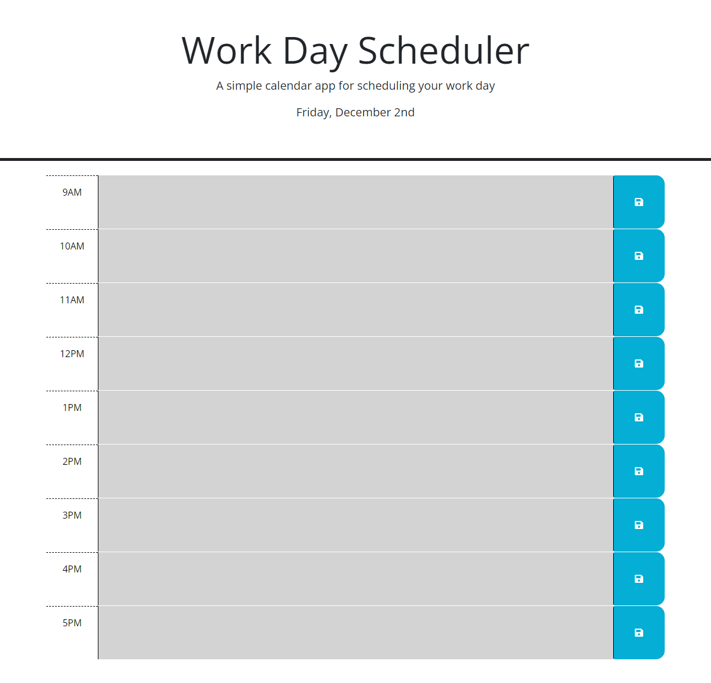

# JQuery-Powered Work Scheduler

## Description
The Work Day Scheduler is a flexable and slightly customizable appointment saver. It allows the user to enter and save notes or appointment reminders with color coded time slots indicating past, current, and future entries. The purpose of this project was to dive in and get comfortable using JQuery coupled with Bootstrap.

Deployed Project: https://decourtney.github.io/jquery-powered-work-scheduler/

 
    
  
          
    

 

## Installation

N/A

## Usage

The scheduler will load time slots from 9am to 5pm unless changed in JavaScript. If there are previously saved notes then they will be loaded into their appropriate time slots. The user can click into any time slot text area and type in their notes. Once the user clicks the blue save button the input is saved to localstorage. The time slots will also highlight grey if that hour has passed, red if its the current hour, and green if the hour is later.

## Credits

N/A

## License

MIT License

Copyright (c) 2022 decourtney

Permission is hereby granted, free of charge, to any person obtaining a copy
of this software and associated documentation files (the "Software"), to deal
in the Software without restriction, including without limitation the rights
to use, copy, modify, merge, publish, distribute, sublicense, and/or sell
copies of the Software, and to permit persons to whom the Software is
furnished to do so, subject to the following conditions:

The above copyright notice and this permission notice shall be included in all
copies or substantial portions of the Software.

THE SOFTWARE IS PROVIDED "AS IS", WITHOUT WARRANTY OF ANY KIND, EXPRESS OR
IMPLIED, INCLUDING BUT NOT LIMITED TO THE WARRANTIES OF MERCHANTABILITY,
FITNESS FOR A PARTICULAR PURPOSE AND NONINFRINGEMENT. IN NO EVENT SHALL THE
AUTHORS OR COPYRIGHT HOLDERS BE LIABLE FOR ANY CLAIM, DAMAGES OR OTHER
LIABILITY, WHETHER IN AN ACTION OF CONTRACT, TORT OR OTHERWISE, ARISING FROM,
OUT OF OR IN CONNECTION WITH THE SOFTWARE OR THE USE OR OTHER DEALINGS IN THE
SOFTWARE.